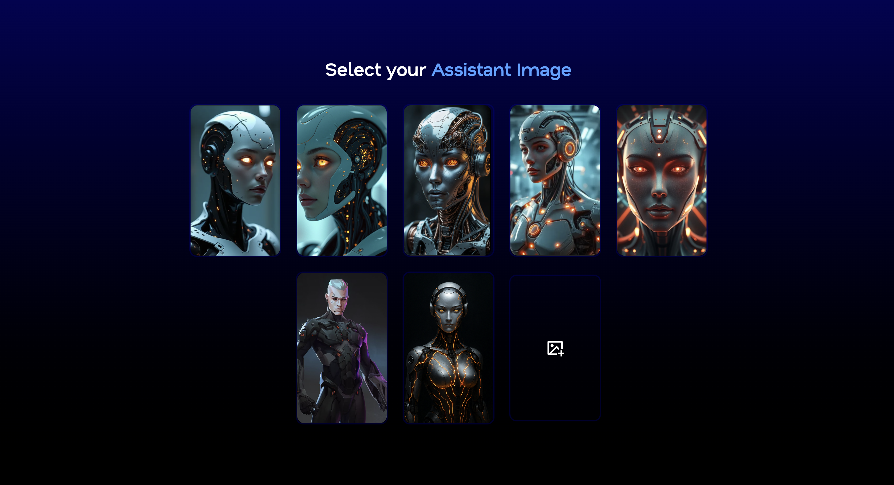
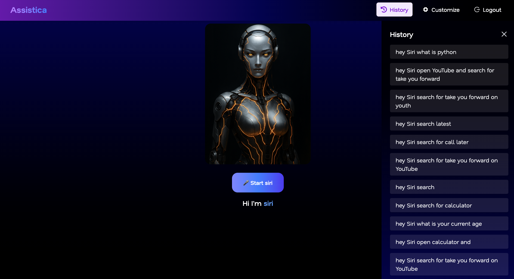
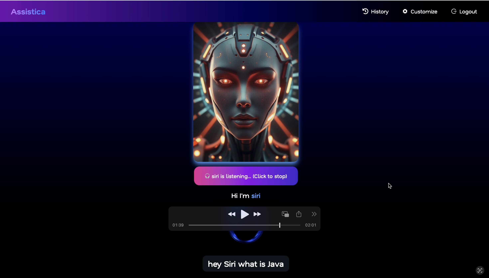
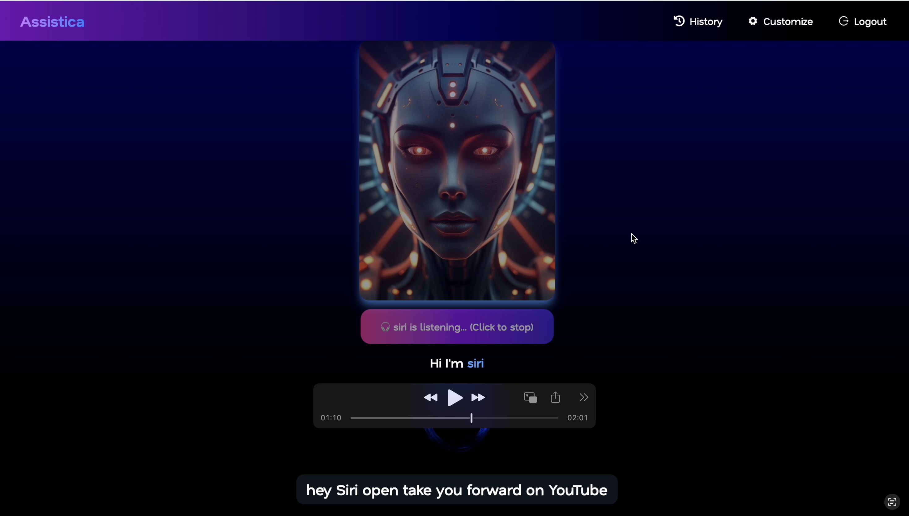
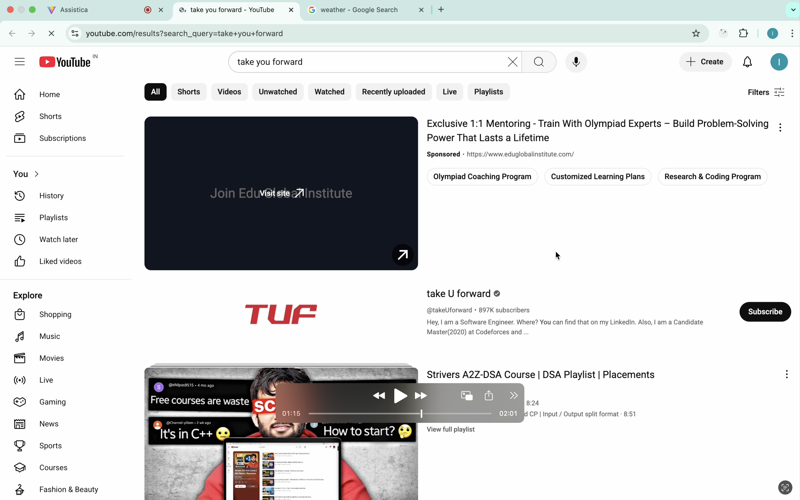

# 🎙️ Assistica – Your Voice-Enabled Virtual Assistant

Assistica is a smart **virtual assistant** that lets users interact seamlessly using **voice commands**.  
It listens to your voice, converts speech to text, processes it with **Google Gemini AI**, and performs actions accordingly.  
Think of it as your personal **AI-powered voice assistant** – open YouTube, search Google, get quick answers, and more!

---

## 🌐 Live Demo

Check out the live application here: [Assistica Live](https://assistica-frontend.onrender.com/)

---

## 📂 Backend Repository

The backend code is available here: [Assistica Backend GitHub](https://github.com/hemanthijjurouthu/Assistica_Backend)

---

## 🚀 Features

- 🎤 **Voice Input** – Speak naturally, and Assistica will understand you.  
- 🧠 **AI-Powered Responses** – Uses **Gemini** to generate accurate, human-like responses.  
- 🔗 **Smart Actions** – Perform tasks like:
  - Opening YouTube & searching videos
  - Performing Google searches
  - Answering general queries
- ⚡ **Real-Time Interaction** – Smooth and fast response handling.  
- 🖥️ **Interactive UI** – Simple and user-friendly React-based interface.  

---

## 🛠️ Tech Stack

- **Frontend:** React, Tailwind CSS  
- **Backend:** Node.js, Express.js  
- **AI Model:** Google Gemini API  
- **Speech Recognition:** Web Speech API  
- **Other Tools:** Axios, Context API

## Screenshots

### Signup Page

## 🎨 Customize Your Assistant

### 1️⃣ Select Your Assistant Image
Choose an image for your assistant from the available options to give it a unique look.

### 2️⃣ Enter Your Assistant Name
Give your assistant a name to personalize your interaction.

### 💬 Virtual Assistant Chat History

### 🖥 Virtual Assistant Interaction

**Question:** What is Java?  

**Answer:** Java explained by Assistant  

**Question:** TUF-related query  

**Answer:** TUF explained by Assistant  

